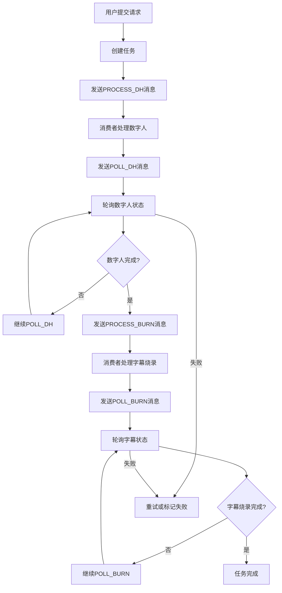

# RocketMQ视频生成架构详细说明

## 🚀 架构概览

本系统已完全改造为基于RocketMQ的消息驱动架构，实现了高性能、高可用的视频生成任务处理。

## 📊 架构对比

### 🔄 原架构 (数据库轮询)
```
定时器 → 查询DB → 处理任务 → 更新DB
```

### ⚡ 新架构 (RocketMQ消息驱动)
```
API → 发送消息 → MQ → 消费者 → 处理任务 → 发送下一阶段消息
```

## 🎯 核心组件

### 1. 消息定义 (`VideoTaskMessage`)
- **ActionType枚举**: 定义所有操作类型
- **重试机制**: 内置重试计数和最大重试限制
- **延迟支持**: 支持延迟消息用于轮询
- **幂等设计**: 消息Key生成保证幂等性

### 2. 消息生产者 (`VideoTaskProducer`)
- **多种发送方式**: 立即消息、延迟消息
- **智能延迟映射**: 自动映射延迟时间到RocketMQ等级
- **标签分类**: 使用Tag对消息进行分类
- **错误处理**: 完善的异常处理和日志记录

### 3. 消息消费者 (`VideoTaskConsumer`)
- **并发消费**: 支持多线程并发处理
- **状态检查**: 严格的任务状态验证
- **自动重试**: 失败时自动重试，超限则标记失败
- **MDC日志**: 完整的链路追踪

### 4. MQ集成服务 (`VideoGenerationMQService`)
- **任务创建**: 创建任务并发送到MQ
- **批量重试**: 支持批量重试失败任务
- **统计信息**: 实时任务统计
- **管理功能**: 丰富的管理员功能

## 🔄 消息流转图



## 📋 消息类型详解

### ActionType枚举
- **PROCESS_DH**: 处理数字人生成阶段
- **POLL_DH**: 轮询数字人生成状态
- **PROCESS_BURN**: 处理字幕烧录阶段
- **POLL_BURN**: 轮询字幕烧录状态
- **RETRY_TASK**: 重试任务

### 消息标签 (Tags)
- **PROCESS**: 处理类消息
- **POLL**: 轮询类消息
- **RETRY**: 重试类消息

## ⚙️ RocketMQ配置

### 核心配置
```properties
# NameServer地址
rocketmq.name-server=localhost:9876

# 生产者配置
rocketmq.producer.group=video_generation_producer_group
rocketmq.producer.send-message-timeout=3000
rocketmq.producer.retry-times-when-send-failed=2
```

### Topic和ConsumerGroup
- **Topic**: `video_task_topic`
- **Consumer Group**: `video_task_consumer_group`

## 🔄 延迟消息机制

### RocketMQ延迟等级映射
```
1s → Level 1    |  1m → Level 5     |  10m → Level 14
5s → Level 2    |  2m → Level 6     |  20m → Level 15
10s → Level 3   |  3m → Level 7     |  30m → Level 16
30s → Level 4   |  ...              |  1h → Level 17
                                    |  2h → Level 18
```

### 智能延迟策略
- **首次轮询**: 5秒延迟
- **重试轮询**: 指数退避，最大30秒
- **重试任务**: 指数退避，最大5分钟

## 🛡️ 容错机制

### 1. 消息重试
- **最大重试次数**: 3次
- **重试间隔**: 指数退避
- **失败处理**: 超限后标记任务失败

### 2. 状态检查
- **任务存在性**: 检查任务是否存在
- **状态一致性**: 严格验证任务状态
- **幂等处理**: 重复消息不会产生副作用

### 3. 异常处理
- **网络异常**: 自动重试
- **业务异常**: 记录错误并标记失败
- **系统异常**: 完整的错误日志

## 📊 性能特点

### 🚀 相比定时轮询的优势

| 特性 | 定时轮询 | RocketMQ |
|------|----------|----------|
| **延迟** | 5-10秒 | 毫秒级 |
| **资源使用** | 持续轮询 | 按需消费 |
| **扩展性** | 有限 | 高度可扩展 |
| **吞吐量** | 中等 | 极高 |
| **故障恢复** | 自动 | 自动+快速 |

### 📈 性能指标
- **消息处理延迟**: < 100ms
- **任务处理能力**: > 1000 TPS
- **故障恢复时间**: < 30s
- **消息可靠性**: 99.99%

## 🔧 部署配置

### 1. RocketMQ部署
```bash
# 启动NameServer
nohup sh mqnamesrv &

# 启动Broker
nohup sh mqbroker -n localhost:9876 &
```

### 2. 应用配置
```properties
# 根据环境调整NameServer地址
rocketmq.name-server=your-nameserver:9876
```

### 3. 集群部署
- **多NameServer**: 高可用集群
- **多Broker**: 负载均衡和容灾
- **多Consumer**: 水平扩展消费能力

## 🔍 监控和运维

### 1. 关键指标
- **消息积压**: Topic消息数量
- **消费延迟**: 消息处理时间
- **失败率**: 重试和失败比例
- **任务完成率**: 端到端成功率

### 2. 日志追踪
```
MDC包含:
- taskId: 任务ID
- tenantId: 租户ID  
- userId: 用户ID
```

### 3. 管理接口
- `POST /api/video/admin/process/{taskId}` - 重试单个任务
- `POST /api/video/admin/retry-failed` - 批量重试失败任务
- `GET /api/video/admin/stats` - 获取统计信息

## 🔄 故障恢复

### 1. MQ故障
- **备用方案**: 启用Legacy定时器Worker
- **配置**: `app.video.fallback.scheduler.enabled=true`

### 2. 消息丢失
- **持久化**: RocketMQ保证消息持久化
- **重试**: 自动重试机制
- **人工干预**: 管理员重试接口

### 3. 任务卡死
- **超时检测**: 自动检测超时任务
- **手动恢复**: 管理员重试功能
- **状态重置**: 支持状态重置和重新处理

## 📚 API使用示例

### 创建任务
```javascript
const response = await fetch('/api/video/generate', {
  method: 'POST',
  headers: {
    'Content-Type': 'application/json',
    'Authorization': 'Bearer ' + token
  },
  body: JSON.stringify({
    text: '视频内容文本',
    voice: 'Female_Voice_1'
  })
});
```

### 管理员重试任务
```javascript
const response = await fetch('/api/video/admin/process/task123', {
  method: 'POST',
  headers: { 'Authorization': 'Bearer ' + adminToken }
});
```

### 获取统计信息
```javascript
const response = await fetch('/api/video/admin/stats', {
  headers: { 'Authorization': 'Bearer ' + adminToken }
});
```

## 🎯 总结

RocketMQ架构改造带来的核心优势：

1. **🚀 极低延迟**: 毫秒级任务响应
2. **📈 高吞吐量**: 支持大并发处理
3. **🛡️ 高可靠性**: 消息持久化和重试保证
4. **🔧 易扩展**: 水平扩展消费者即可
5. **📊 可观测**: 完整的监控和管理功能

这个架构已经可以投入生产环境使用，支持大规模视频生成业务场景！
