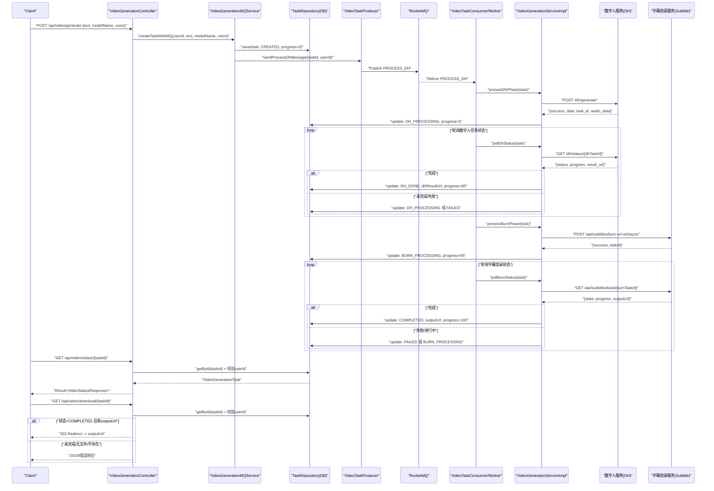

## 视频生成三接口文档

本文档描述视频生成相关的三个接口：创建任务、查询状态、下载结果。接口实现位于 `enlighten-platform-web` 模块的 `com.zhongjia.web.controller.VideoGenerationController`。

### 基础信息
- 基础地址：`http://localhost:8080`
- 接口前缀：`/api/video`
- 身份认证：所有接口需要 `Authorization: Bearer <JWT>`

### 统一响应结构
除下载接口重定向场景外，统一返回体如下：

```json
{
  "code": 200,
  "message": "操作成功",
  "data": { /* 业务数据 */ }
}
```

错误时：

```json
{
  "code": <业务码>,
  "message": "<错误信息>"
}
```

---

### 1) 创建视频生成任务
- 方法与路径：`POST /api/video/generate`
- 请求头：
  - `Content-Type: application/json`
  - `Authorization: Bearer <JWT>`
- 请求体字段：
  - `text` string，必填，≤ 5000 字符
  - `modelName` string，可选，数字人模型名称
  - `voice` string，可选，默认 `Female_Voice_1`

请求示例：

```http
POST /api/video/generate HTTP/1.1
Host: localhost:8080
Authorization: Bearer <JWT>
Content-Type: application/json

{
  "modelName": "17552381569271.mp4",
  "text": "大家好，我是数字人1号……",
  "voice": "Male_Voice_1"
}
```

成功响应示例：

```json
{
  "code": 200,
  "message": "操作成功",
  "data": {
    "taskId": "8fe216c532b454402398a92f721ff3d2",
    "message": "视频生成任务创建成功"
  }
}
```

可能错误：
- 400 参数校验失败（`text` 为空或过长）
- 500 创建任务失败（如 MQ 发送异常）

---

### 2) 查询任务状态
- 方法与路径：`GET /api/video/status/{taskId}`
- 请求头：
  - `Authorization: Bearer <JWT>`
- 路径参数：
  - `taskId` string，任务ID

成功响应示例：

```json
{
  "code": 200,
  "message": "操作成功",
  "data": {
    "status": "BURN_PROCESSING",
    "progress": 72,
    "resultUrl": "https://example.com/final.mp4",
    "message": "字幕烧录中...",
    "createdAt": "2025-08-27 22:04:31",
    "updatedAt": "2025-08-27 22:05:40"
  }
}
```

状态取值：`CREATED` / `DH_PROCESSING` / `DH_DONE` / `BURN_PROCESSING` / `COMPLETED` / `FAILED`

说明：
- `message` 字段：有错误时返回错误信息，否则返回友好的状态文案。

可能错误：
- 404 任务不存在或无权限
- 500 查询异常

---

### 3) 下载视频结果
- 方法与路径：`GET /api/video/download/{taskId}`
- 请求头：
  - `Authorization: Bearer <JWT>`
- 行为：
  - 若任务状态为 `COMPLETED` 且存在 `outputUrl`，返回 `302` 重定向至实际视频地址。
  - 否则返回 JSON 错误（下载接口在错误时返回如下结构）：

```json
{"code":400,"success":false,"msg":"任务尚未完成","data":null}
```

或：

```json
{"code":404,"success":false,"msg":"视频文件不存在","data":null}
```

当任务不存在/无权限：返回 `404` JSON；服务异常：返回 `500` JSON。

---

### 进度与阶段
- 数字人阶段：约 5%–60%（`DH_PROCESSING` → `DH_DONE`）
- 字幕烧录阶段：约 65%–100%（`BURN_PROCESSING` → `COMPLETED`）

---

### 调用链路（Mermaid 序列图）



---

### 参考实现位置
- 控制器：`enlighten-platform-web/src/main/java/com/zhongjia/web/controller/VideoGenerationController.java`
- 服务（MQ 入口）：`enlighten-platform-biz/src/main/java/com/zhongjia/biz/service/VideoGenerationMQService.java`
- 服务（核心流程）：`enlighten-platform-biz/src/main/java/com/zhongjia/biz/service/impl/VideoGenerationServiceImpl.java`
- 实体：`enlighten-platform-biz/src/main/java/com/zhongjia/biz/entity/VideoGenerationTask.java`


